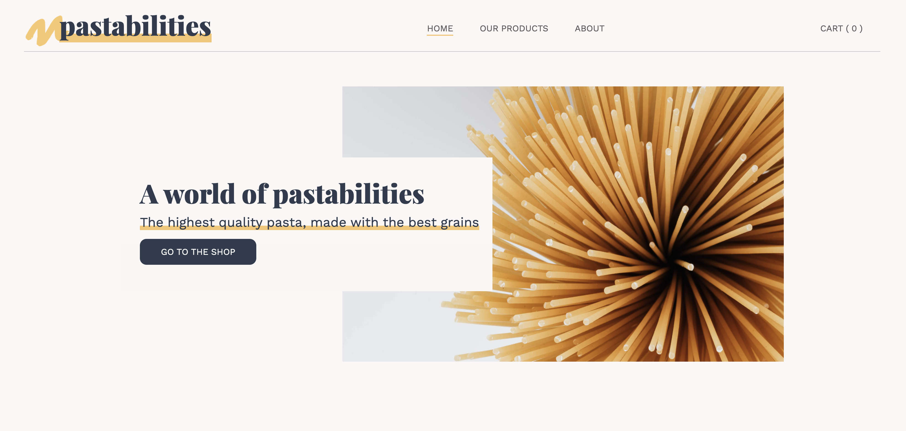
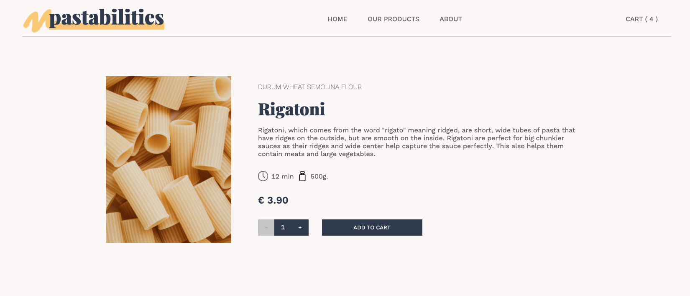
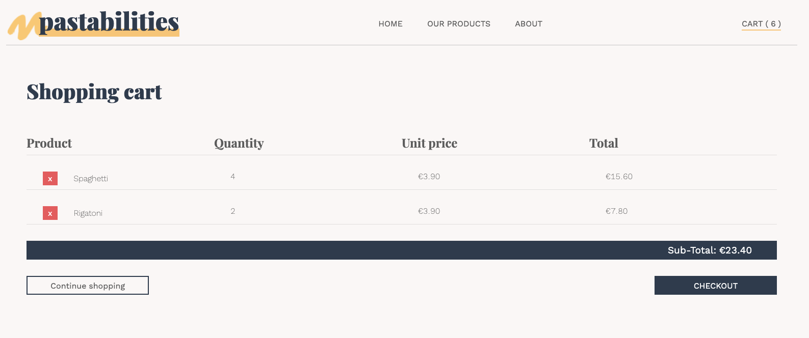

# Pastabilities, Next.js e-commerce store

The e-commerce store is a full-stack application that simulates a real webshop page that sells pasta products.

**Desktop version** : this shop is optimised to be used in resolutions with a **width bigger than 1680px**.

The shop displays a products page where all items are listed. The main features are:

- The user can browse through different pasta products and filter by pasta category (e.g. fresh pasta).
- The user can select and order an amount of pasta packages and is able to add them to the shopping cart.
- The user can always check how many items are in the shopping cart by looking at the header.
- From the shopping cart, products can be removed or the user can proceed to the checkout page and finalise the order.

## Technologies used

**Client:** Next.js, React, TypeScript, Styled Components, Jest

**Server:** Node.js, PostgreSQL

## Screenshots

### Landing page



### Products overview page


### Product description page



### Shopping cart page



## Setup guide

To run this project locally, the following steps are needed:

1. Clone this repo on your local machine and connect to your GitHub account

2. Download and install PostgreSQL (if not installed yet).

- https://www.postgresql.org/download/

3. Create a User and a Database for the project.

4. Create a copy of the `.env.example` on the root of the project and modify it with your credentials. The file should include these four environment variables:

- PGHOST=localhost
- PGDATABASE=\<nameOfYourDatabase>
- PGUSERNAME=\<nameOfYourUsername>
- PGPASSWORD=\<nameOfYourPassword>

5. Rename this file to .env .
6. On the command Line go to the project directory and install the required dependencies with:

```bash
yarn
```

7. Install the dotenv-cli globally with:

```bash
yarn global add dotenv-cli
```

8. Run the migrations for your local database with:

```bash
yarn migrate up
```

9. Start the server with:

```bash
yarn dev
```

## Deployment instructions

The following instructions can be used to deploy the application online using Heroku:

1. Create a repository with your version of the app.
2. Sign up on Heroku: https://signup.heroku.com/ and create an account
3. Create a new App with your preferred name
4. Choose a name and select your region
5. On "deploxment method", go to "Connect to GitHub" and select your repository
6. Click on the "Enable Automatic Deploys" button
7. Go back to the Overview tab and click on "Configure Add-On". Search for "Postgres" and select "Heroku Postgres" from the results
8. Trigger the deployment by pushing into your github repository
